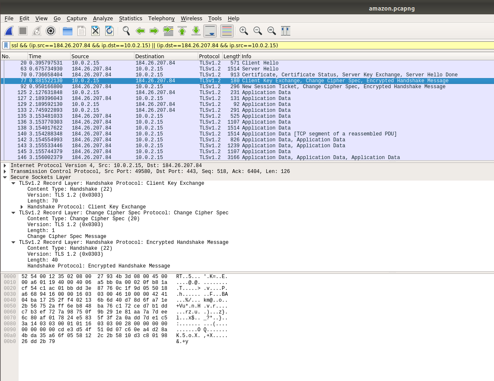
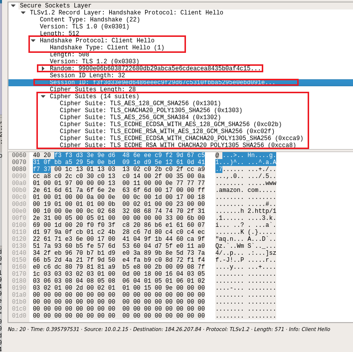
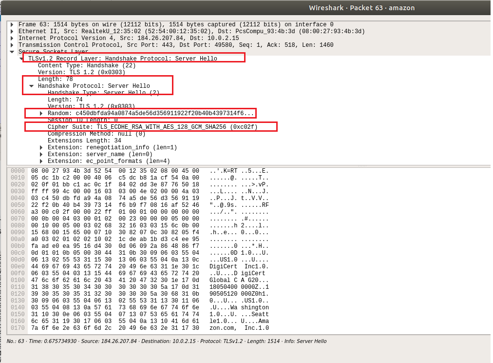
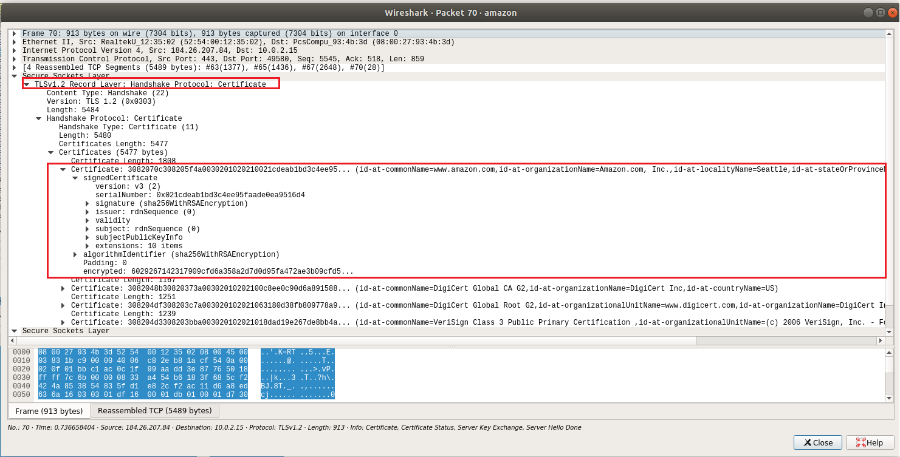
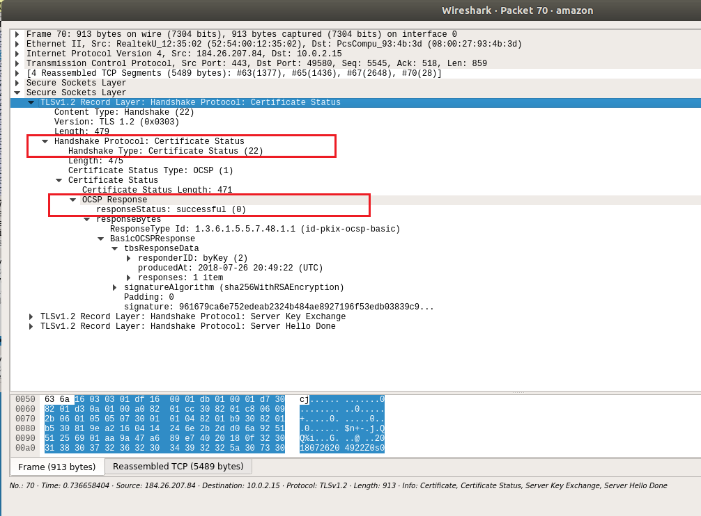
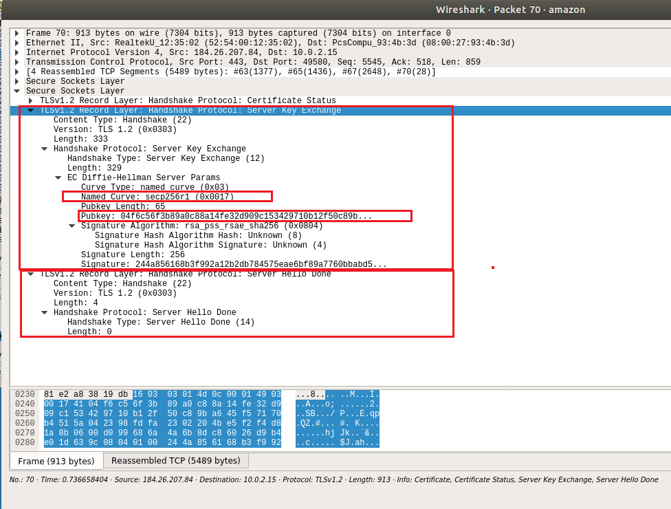
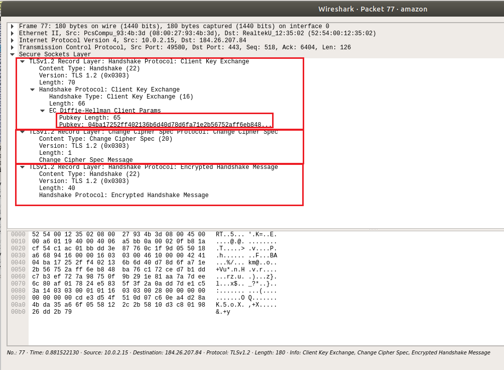
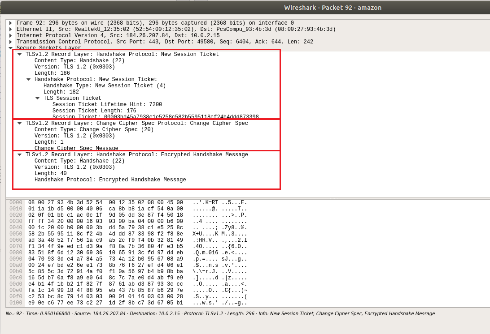

---
# SSL/TLS

## ~Arpit
---
## Table of contents:
* <a href="#/3"> WHAT IS SSL/TLS </a>
* <a href="#/4"> WHY IS IT USED </a>
* <a href="#/5"> Encryption Methods </a>
* <a href="#/6"> Basic idea of how SSL/TLS works </a>
* <a href="#/7"> SSL/TLS HANDSHAKE </a>
* <a href="#/15"> POODLE ATTACK </a>
* <a href="#/15"> References </a>
---
## WHAT IS SSL/TLS
Transport Layer Security (TLS) – and its predecessor, Secure Sockets Layer (SSL), which is now deprecated by the Internet Engineering Task Force – are cryptographic protocols that provide communications security over a computer network. Several versions of the protocols find widespread use in applications such as web browsing, email, instant messaging, and voice over IP (VoIP). Websites are able to use TLS to secure all communications between their servers and web browsers.
---
## WHY IS IT USED ?
SSL/TLS is basically the secure connection that is put up over http traffic. HTTP traffic if sniffed contain the data in plain text. This can lead Eavesdroppers to easily access all the login information and other confidential information. Apart from that, there is an integrity issue on the data as the man in the middle attack can easily be performed. This is where the idea to encrypt the data over network came into picture.
---
# Encryption Methods
----
## * Symmetric-key encryption
Symmetric-key algorithms[1] are algorithms for cryptography that use the same cryptographic keys for both encryption of plaintext and decryption of ciphertext. The keys may be identical or there may be a simple transformation to go between the two keys.
* EG : DES(Data Encryption Standard), AES(Advanced Encryption Standard), Triple DES
----
## * Asymmetric-key encryption
 Asymmetric cryptography, also known as public key cryptography, uses public and private keys to encrypt and decrypt data. The keys are simply large numbers that have been paired together but are not identical (asymmetric). One key in the pair can be shared with everyone; it is called the public key.
 * EG : DSA, RSA, PGP, Elliptic curve techniques, PKCS
---
## Basic idea of how SSL/TLS works
* The basic idea of using a secure layer is to use an establish the connection
using asymmetric encryption. 
* Then the client's browser would send the symmetric key to the server using this secure layer.
* This can be achieved by encrypting the symmetric cipher with the server's public key. Now only the server will be able to decrypt this with their private key.
----
* Since private key is not known to anyone except the server, so no one else is able to decrypt
the symmetric key.
* Now once both the server and the client has the symmetric key(and no one else has it), they
switch to symmetric key encryption in order to further make requests.

---
## TLS Handshake
1) Client Hello <br>
2) Server Hello <br>
3) Client Key Exchange <br>
4) Completing the Key Exchange <br>
5) Change cipher spec <br>
6) Server Change CipherSpec, and Server Finished <br>
7) Application Data
----
## TLS Handshake Capture

---
## 1) Client Hello
* Whenever a client wants to communicate to the server, it first
establishes the TCP connection (by performing TCP handshake). Once that is done,
the client sends the "Client Hello" request over the TLS protocol. It means that the
client is requesting the server to communicate over secure layer.
* Along with the request, the client send the "Cipher Suites", that it can support,
random numbers and the session id.
----
* Cipher Suite are set of various cryptographic algorithms. This is sent in the highest to
lowest order of preference. And the server selects the highest one which it can
support. There has to be a common agreement between both of them, otherwise SSL
handshake cannot occur.
* The random numbers also called nonce are later used to generate symmetric
encryption keys on both sides.
----
* Session id is mentioned when the client wants to resume a previous session,
otherwise null. SSL/TLS handshake consumes a lot of resource both in client side as
well as server side. So, it makes well use of the handshake by pausing and resuming
the same connection whenever needed.
----

----
### Understanding the Cipher Suites

* __key exchange algorithm__ - dictates the manner by which symmetric keys will be exchanged;
* __authentication algorithm__ - dictates how server authentication and (if needed) client authentication will be carried out. 
* __bulk encryption algorithm__ - dictates which symmetric key algorithm will be used to encrypt the actual data; and 
* __Message Authentication Code (MAC)__ - dictates the method the connection will use to carry out data integrity checks.
----
* Some key exchange algorithms: RSA, DH, ECDH, ECDHE;
* Some authentication algorithms: RSA, DSA, ECDSA;
* Some bulk encryption algorithms: AES, 3DES, CAMELLIA;
* Some MAC algorithms: SHA, MD5
----
### TLS_ECDHE_ECDSA_WITH_AES_256_CBC_SHA384
Let's break that down.<br>
* TLS simply indicates the protocol;
* ECDHE signifies the key exchange algorithm;
* ECDSA signifies the authentication algorithm;
* AES_256_CBC indicates the bulk encryption algorithm; and
* SHA384 indicates the MAC algorithm.
----
### DHE_RSA_AES256_SHA
Again, breaking that down, we have: <br>
* DHE - the key exchange algorithm;
* RSA - the authentication algorithm;
* AES256 - the bulk encryption algorithm; and
* SHA - the MAC algorithm
---
## 2) Server Hello
* The first is "Server Hello" message, that means the server is ready to use the SSL/TLS connection. Along with that, it sends the Cipher Suite that it wants to communicate in, and some random numbers also. There are other parameters as well depending upon the Cipher Suite that has been chosen.
----
### Server Hello

----

* Then the server send the certificate chain to the client. Each certificate comes with information about domains it supports, who it was issued by, and the time period of its validity.
<br><br>
These certificates are issued by the Certificate Authorities. They put up a digital signature (using their private key). These certificates are by then default trusted by the browser. (certificates basically ensure that the server we are communicating with is the genuine one, so I can trust the public key provided to the browser by the server).
----
### Server Certificate

----
* Next is the Certificate Status : Clients can consult OSCP (Online Certificate Status Protocol) server to check whether the server certificate has been revoked. The OSCP server returns with the status code whether it is valid or not.


----
* Server Key Exchange : In this message, server mentions the curve that it is going to use to generate the public key. With knowledge of the curve to be used, both the server and client will know the crucial p and G values for ECDHE. The server will choose a random private key ___'a'___ and compute <u>___[G^a mod p] as its public key___</u> and send this is send to the client.
* Server Hello Done : This simply mentions that the client can further communicate with the server.
----

---
## 3) Client Key Exchange
Now, the client must send its own ephemeral public key (for DH). This is calculated
by generating a random private key 'b' and from there calculating <u>[G^b mod p]</u> as its public
key.<br>
By doing this, both server and client can calculate a common value <u>[g^ab mod p]</u>.
Since a and b are unknown to the attacker, thus this common value is very difficult to
calculate the pre-master secret key. This becomes the pre-master key, which may be used
as session encryption keys.
----
## Client Key Exchange

---
## 4) Completing the Key Exchange
----
* #### Converting the pre-master secret into master key.

The master key is of a fixed length of 48 bytes. We make use of PRF (Pseudo Random Functions) which basically given an input will produce an output computationally indistinguishable from a truly random sequence.<br>
Master key is computed as
```
master_secret = PRF(pre_master_secret, "master secret", 
		ClientHello.random + ServerHello.random) [0..47];
```
ClientHello.random and ServerHello.random are the values that were sent during the
client hello and server hello respectively.
---
## 5) Change cipher spec
The client change the cipher spec that was being used. This message is the
indication to the server that the cipher that was being used is about to change. After this is
sent, all the messages are encrypted.
The next message from the client is the client handshake finish. This contains the hash of a
all the handshakes that has taken place with the server. This is done in order to ensure that
there wasn't any tampering in the packets.
---
## 6) Server ChangeCipherSpec, and Server Finished
On getting the client handshake finish, the server will send its own handshake finish
and verify the contents of the handshake.
----

---
## 7) Application Data
First, we generate a MAC(Message Authentication Code), key, and IV (Initialization Vector) for both the client and the server using our master secret and the PRF definition from earlier.
```
key_data = PRF(master_secret, "key expansion", server_random + client_random);
```

Now the key data represents the following :
```
client_write_MAC_key = key_data[0..31]
server_write_MAC_key = key_data[32..63]
client_write_key = key_data[64..79]
server_write_key = key_data[80..95]
client_write_IV = key_data[96..99]
server_write_IV = key_data[100..103]
```
----
The MAC keys are for authentication and integrity. The write keys are for the symmetric encryption. One key per side (client and server) is maintained. This segregates the keys. We also construct additional_data and an 8-byte nonce, both of which are sent with the encrypted data.
```
additional_data = sequence_num + record_type + tls_version + length
nonce = <random_8_bytes>
```

Finally, we can encrypt our data with AES GCM!
```
encrypted = AES_GCM(client_write_key, client_write_IV+nonce, <DATA>, additional_data)
```
----
And the server can read it with,
```
<DATA> = AES_GCM(client_write_key, client_write_IV+nonce, encrypted, additional_data)
```
---
## Poodle Attack
This is one of the most famous vulnerability found in the SSL/TLS connection that takes advantage of Padding Oracle Attacks.
POODLE stands for Padding Oracle on Downgraded Legacy Encryption.

There are various cipher suites among which, many are very weak, and have some common known vulnerabilites. 
Suppose the best cipher suite that the client can communicate is C. So it sends out that cipher suite. 
----
But the attacker in the middle poses as client, and sends out cipher suite C', which maybe the worst possible cipher suite. Server having no other option, replies with the same cipher suite, and thus client and server starts communicating in that cipher suite. They specifically downgrade the suite to SSL 3.0, which has got a vulnerability call padding oracle attack. With this, the attacker will be able to sniff traffic very easily.
----
The simple patch to this is to completely stop using SSL 3.0 and switch to TLS
There are other mitigations as well. Like there cannot be a sudden switch from best to worst cipher in the available cipher suites. They can only be downgraded one by one to match the best cipher suite available.

<br><br>
More about padding oracle attack : 
https://www.youtube.com/watch?v=BbwC8f_aBMQ
---
## References:
https://www.cryptologie.net/article/340/tls-pre-master-secrets-and-master-secrets/
https://tlseminar.github.io/first-few-milliseconds/
http://www.moserware.com/2009/06/first-few-milliseconds-of-https.html
http://blog.catchpoint.com/2017/05/12/dissecting-tls-using-wireshark/
https://www.youtube.com/watch?v=Rp3iZUvXWlM&t=922s
https://medium.facilelogin.com/nuts-and-bolts-of-transport-layer-security-tls-2c5af298c4be
